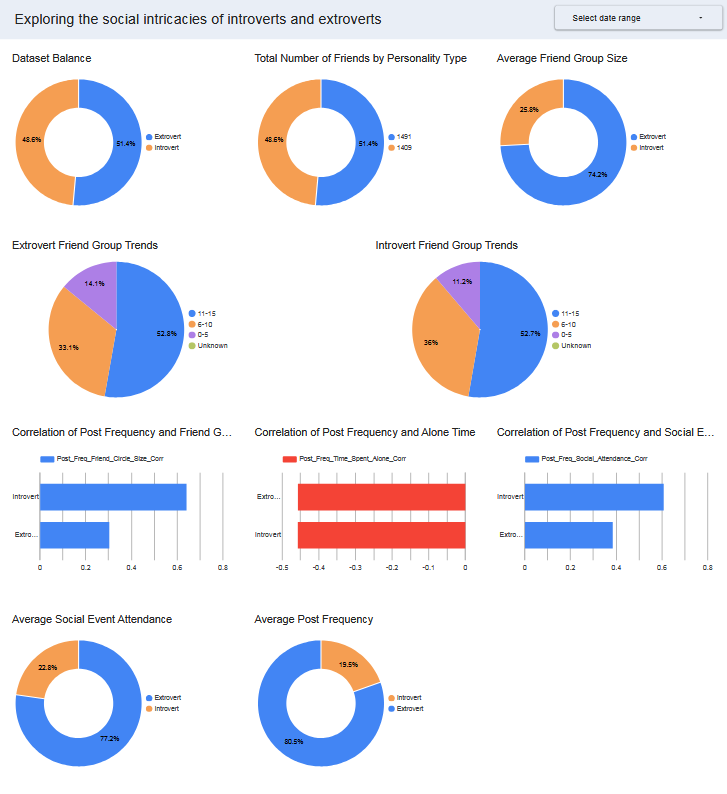

# 🎭 IntroExtroScope

[](https://cloud.google.com/)
[](https://cloud.google.com/bigquery)
[](https://www.databricks.com/)
[](https://www.python.org/)
[](LICENSE)

> A cloud-native behavioral analytics project exploring **introvert vs. extrovert** patterns using **Google BigQuery**, **Databricks**, and **Google Cloud Platform**.

---


## 📊 Project Overview

**IntroExtroScope** analyzes patterns of **introversion and extroversion** through a structured data science pipeline:

- 🔍 Exploratory Data Analysis (EDA)
- 🔮 Predictive Modeling
- 📈 Data Visualization

The entire pipeline is deployed using **BigQuery SQL for analytics**, **Databricks for processing**, and **GCP for scalability**.

---

## 🧠 Objectives

- Understand behavioral trends in personality types.
- Build models to **predict introversion/extroversion** from features.
- Create visualizations to support **data storytelling**.

---

## 🛠️ Tech Stack

| Component        | Tool/Service                |
|------------------|-----------------------------|
| Data Storage     | Google Cloud Storage        |
| Data Processing  | Databricks + Big Query      |
| Visualization    | Databricks + Looker Studio  |

---

## 📂 Folder Structure (To Complete)

```bash

```


---

## 📉 Analysis Results



---

## 🔮 Data Enrichment with Logistic Regressor

| Train AUC         | Validation AUC | Test AUC |
|-------------------|----------------|----------|
| 0.911             | 0.870          | 0.92     |


---

## 🚀 How to Run The Local Jupyter Lab Notebook

```bash
# Clone repo
git clone https://github.com/yourusername/introextroscope.git
cd introextroscope
```

1) Download the following `dependencies`

| `Software`   |  `Version` |
|--------------|------------|
| `Python`     | `3.13.2`   |
| `pip`        | `25.0`     |

2) Download the `python` dependecies required to run the `notebook` locally

```bash
python -m pip install -r requirements.txt
```

3) Run the `jupyter lab` notebook

```bash
cd ./notebooks
jupyter lab
```

---